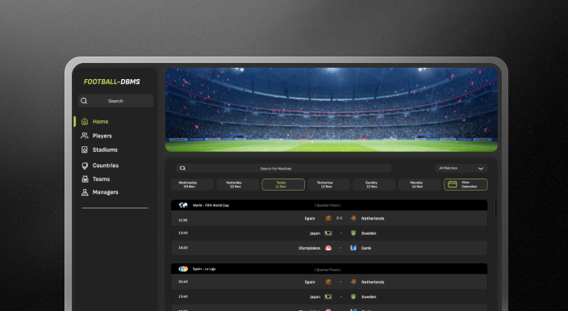

# Soccer-League-DBMS
The Soccer League Database Management System is designed to effectively manage and organize information related to a soccer league. The objective of this system is to allow soccer enthusiasts access information and statistics related to the soccer league. Sports statisticians can leverage this data to analyze and manage information related to the soccer league and make necessary updates after a match has concluded. 

These soccer fans visit online statistics trackers where they can freely browse through a repository of information on the different players, their nationalities, their associated clubs and the games they played in. This information would include the list of all matches held, optionally organized by season, and each match would have a breakdown of the goals, who scored them, who refereed the match, and the team that won or lost, etc. In addition, fans also enjoy the ability to access records on the individual player and club statistics which includes information on them such as their shirt number, position, number of matches played, lost, drawn and won goals, minutes played, management, and acquired cards. 

On the backend, each of these data entities have unique_ids that are randomly generated or formed as a concatenation of other attributes. The relationships between them act so that the data is easily sorted and filtered as a user would desire, for instance if they wanted to find all the matches or all the players who played in a specific season. The Player, Manager, and Referee entities all depend on the Person entity because they share common attributes.

The goal is to provide users of the database system, whether they are casual enthusiasts, players, managers, coaches, or others, with the latest, accessible, and digestible advanced soccer analytics. Users can leverage this information to enhance their understanding of the sport or implement changes within their own teams.

  

